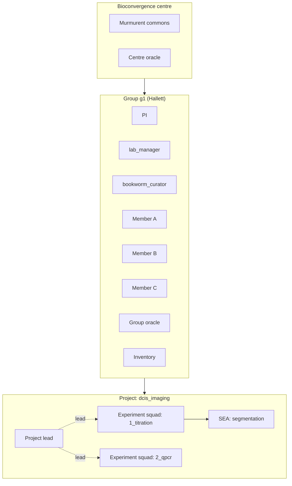
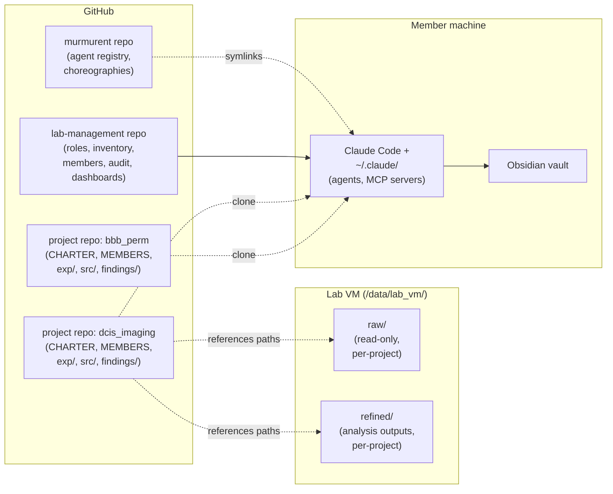
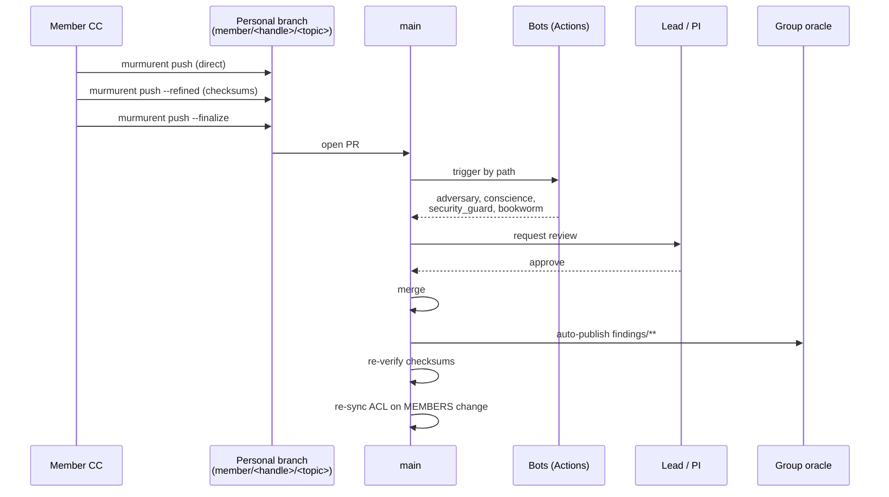
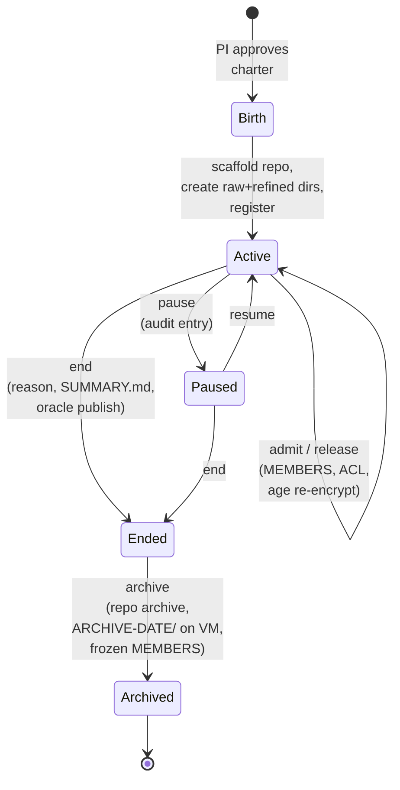
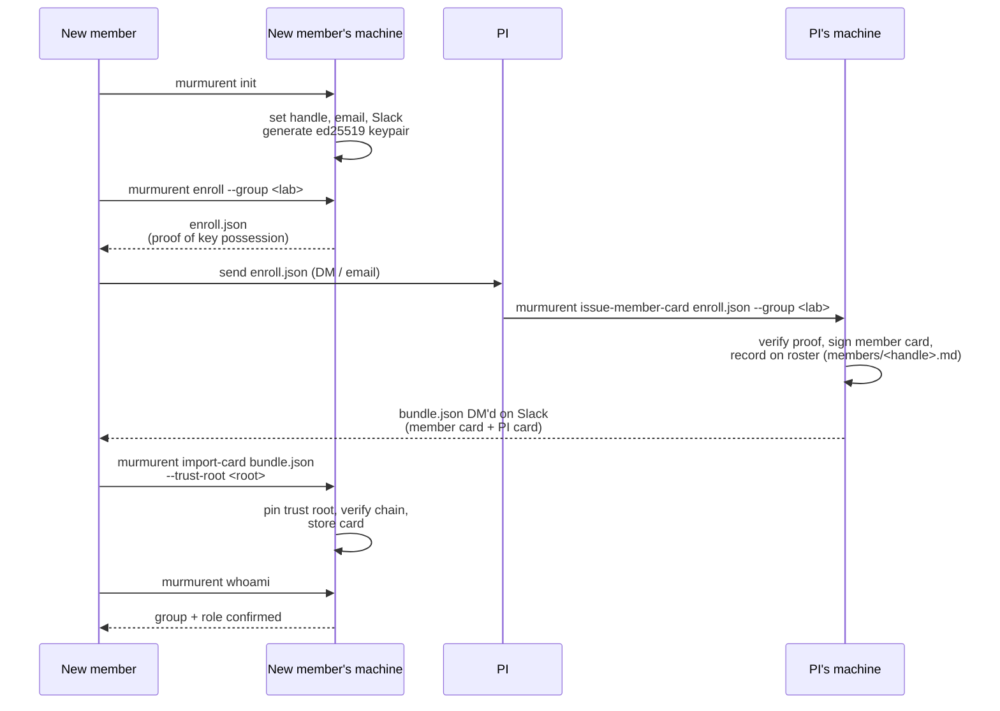
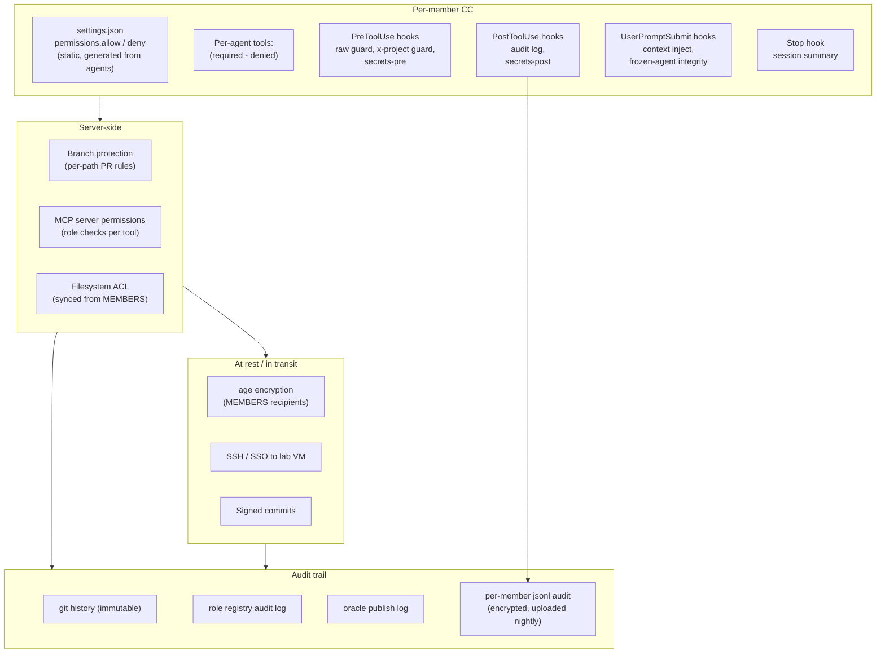
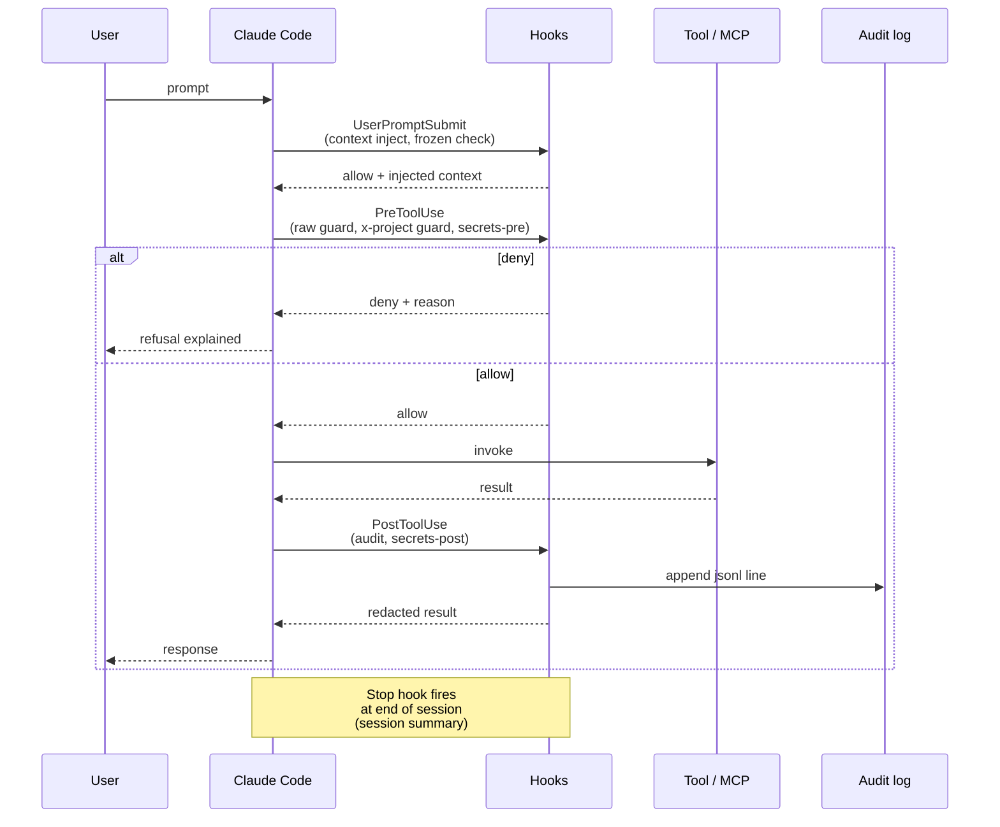

# Murmurent — Diagrams

> Mermaid diagrams for the group-level design. Companion to [[group_level]] and [[cli_manual]].
> Mermaid renders natively in Obsidian (with the official renderer) and on GitHub.
> Update alongside the design doc whenever structural concepts change.

## 1. Tier architecture

The Murmurent hierarchy: centre → group → project → squad → member.

## 2. Repo and data layout

Three classes of repo plus the lab VM. Data never lives in the repos.

## 3. Push mechanics

Member commits land on a personal branch; `--finalize` opens a PR; bots review per path; merge fires auto-publish hooks.

## 4. Project lifecycle

State diagram of a project's life from charter to archive, with transitions and required artefacts.

## 5. Onboarding sequence

Four stages: identity, enrollment, issuance, confirmation. Membership is a
signed certificate (see [identity.md](identity.md)); the roster follows from
issuance, not from a PR.

## 6. Permissions surface

The layers of access control. Static lists block the obvious; hooks block the contextual; audit records what happened either way.

## 7. Hook flow

How the seven hooks fire around a tool call within a CC session.

