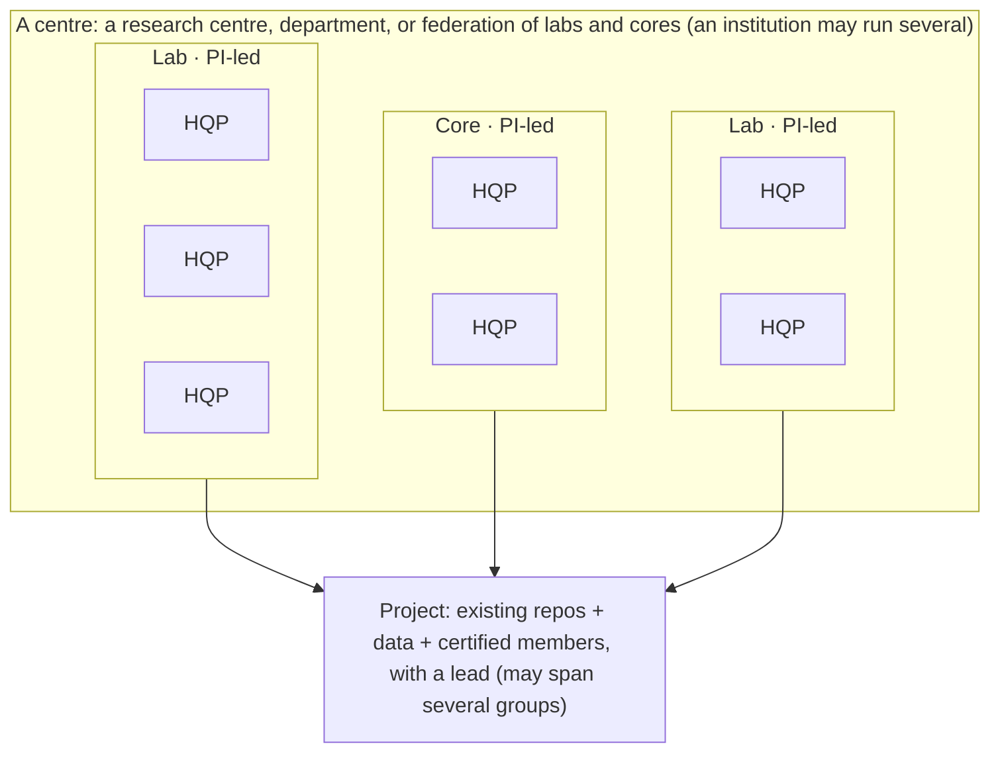

# Overview: members, groups, projects

This page defines the units Murmurent works with and how they fit together.
The remaining pages in this section describe each in detail.

## The units

- **Member.** An individual researcher, one of a group's **highly
  qualified personnel (HQP)**, identified by a handle (for example
  `@member_a`). Each member has their own agents, their own personal
  vault, and their own machine state.
- **PI.** The principal investigator who leads a group. A PI issues
  membership identities to the group's members and owns the group's
  governance repository.
- **Group.** A group is either a **lab** (a research group) or a **core**
  (a shared facility, such as a proteomics or imaging centre). A core is a
  kind of group, led by a PI, that provides services to other groups.
  Every group owns its members, its data, and its workflows.
- **Project.** A unit of work that brings members together around shared
  repositories and data. A project has a single **lead** (often, but not
  necessarily, the PI). Its members can come from a single group or from
  several groups at once.
- **Centre.** A collection of labs and cores. In an academic setting a
  centre corresponds to a research centre, a department, or another
  federation of labs and units with shared scientific goals. A centre is
  run by an administration (a Mayor and a registrar), which maintains the
  registry of groups and projects and issues the identity certificates
  that bind members, groups, and projects together. An institution can run
  more than one centre. Centres are covered in their own section.

A centre contains many labs and cores; each group contains many members
(its HQP); and a project draws its members from one or more groups:

## How repos and projects combine

A member's work lives in **repositories** (git clones under `~/repos/`). A
Murmurent-ready repository has the commons agents and rules wired in; see
[Making a repo Murmurent-ready](ready_vs_projects.md).

A **project** is a higher-level construct: a set of existing repositories,
the machines they run on, and cryptographically certified members, with the
creator as its lead. One project can span several repositories, and its
members can be drawn from more than one group. How a project is created is
described in [Creating a project](project_intra.md) (within one group) and
[Creating a project across labs](project_inter.md) (across groups).

A group operates across three classes of repository, each with a distinct
role:

- the **commons** (`hallettmiket/murmurent`): the shared agents, rules,
  hooks, and CLI, cloned by everyone;
- the **lab-management repository** (`murmurent_lab_mgmt_<lab>`): one per
  group, holding the roster, role registry, project registry, inventory,
  and the lab Oracle;
- **project repositories**: one or more per project, holding the
  experiments, code, and findings for that project.

The full inventory of what Murmurent creates, on GitHub and on each
machine, is in [What Murmurent creates](what_mm_creates.md).

## Cross-group services (SEAs)

Members sometimes need something from a member of another group: a piece of
analysis, a reusable skill, or an experiment run on a shared instrument.
Murmurent models these requests as **SEAs** (Skills, Experiments-as-events,
and Analyses): atomic, callable units of service that one member requests
and another fulfils, mediated through a request board and an audit trail.
SEAs are described in [Cross-group services (SEAs)](seas.md).
