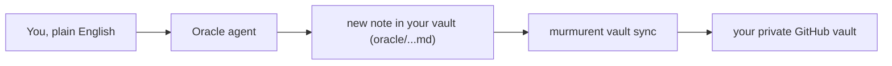

# Vignette 1: save a fact to your oracle

## The situation

Sam is looking at the sample table and notices that ESR1 (the
estrogen-receptor gene, "ER") reads noticeably higher in the tumour
samples than the normal ones. Sam wants to write this down before
moving on, so it isn't forgotten by next week.

## What you type

Sam just says it, in plain English, to Claude Code:

> "Remember that ESR1 looks high in several of my tumour samples:
> worth checking against ER status once the pathology data comes in.
> This is for my brca_er project."

## What Murmurent does

1. Claude Code hands the fact to the **oracle** agent.
2. The oracle agent checks it has everything it needs: what the fact
   is, which project it belongs to, who observed it. If something is
   missing, it asks Sam instead of guessing.
3. It writes a new note into Sam's vault, at
   `oracle/2026-07-16_esr1-high-in-tumour-samples.md`.
4. It adds a one-line pointer to `oracle/MEMORY.md`, the master index
   the oracle reads first every time, so the note is easy to find later.
5. The note is now sitting in Sam's vault, ready to be searched or
   recalled later.



## What you get

The note is a plain markdown file, sitting in Sam's vault:

```markdown
---
title: ESR1 looks high in several tumour samples
date: 2026-07-16
project: brca_er
sensitivity: standard
tags: [esr1, breast-cancer, observation]
sources: ['@sam']
---

# ESR1 looks high in several tumour samples

While looking at the sample table, ESR1 (the estrogen-receptor gene)
read noticeably higher in the tumour samples than the normal ones.
Worth checking against ER status when the pathology data arrives.
```

It's already sitting in Sam's Obsidian vault, so Sam can open Obsidian
right away and see it there, no extra step needed.

To back it up to Sam's private GitHub vault, Sam runs one command in a
terminal:

```
murmurent vault sync
```

This commits and pushes the new note (best-effort), and prints
something like `committed: yes · pushed: yes`. The oracle agent never
runs git itself: syncing is a deliberate, separate step that Sam
controls.

??? note "Under the hood"
    The six frontmatter fields above are required by the
    [oracle entry schema](https://github.com/hallettmiket/murmurent/blob/main/rules/oracle_schema.md),
    and the note uses Obsidian `[[wikilinks]]` (not plain markdown
    links) so it shows up correctly in Obsidian's graph view. See the
    [oracle workflow](../oracle-workflow.md) for how saved entries can
    later be recalled or published to the lab,
    [what Murmurent touches in your vault](../obsidian-usage.md) for
    exactly which folders it reads and writes, and
    [setting up your personal vault](../vault-setup.md) for what
    `vault sync`, `vault info`, and `vault paths` do day to day.
