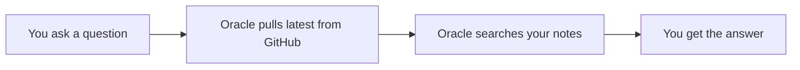

# Vignette 2 — recall a fact

## The situation

Weeks later, Sam has forgotten the details of that ESR1 observation
from vignette 1. Sam just remembers it was something about tumour
samples, and wants to check it before writing up a lab meeting slide.

## What you type

Sam asks the **oracle** agent in Claude Code, in plain English:

> "What did I note about ESR1?"

## What Murmurent does

1. Before searching anything, the oracle automatically pulls the
   latest version of Sam's vault from GitHub — so if Sam (or one of
   Sam's other machines) saved something new, it's already here. Sam
   doesn't run any command for this; it happens on every recall.
2. The oracle searches Sam's saved notes for anything matching ESR1.
3. It finds the note from vignette 1 and reads it back to Sam.

## What you get

Sam asks:

> "What did I note about ESR1?"

The oracle answers, in plain English:

> "On 2026-07-16 you noted that ESR1 looked high in several tumour
> samples, and that it was worth checking against ER status once the
> pathology data came in. That's from your brca_er project."

Sam now has the answer without having to remember where the note
lives or what it was called.

??? note "Under the hood"
    If a search comes back surprisingly empty, `murmurent oracle doctor`
    checks that Murmurent can actually read your vault. See
    [the oracle workflow](../oracle-workflow.md) for more on how
    recall and search work, and
    [what Murmurent touches in your vault](../obsidian-usage.md) for
    the "looks empty" / Full Disk Access gotcha.
