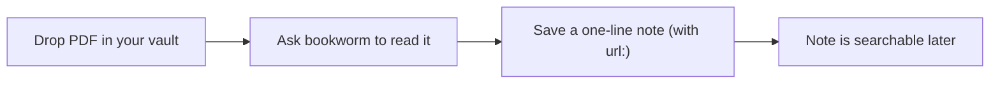

# Vignette 4 — add a manuscript (PDF)

## The situation

Sam finds a paper about ESR1 in breast cancer and wants to keep the
key point somewhere Claude can find it later, without losing the
paper itself.

## What you type

Sam drops the PDF into a folder in the vault — Sam's own choice, say
`papers/`. Then Sam asks Claude, in plain English:

> "Can you read this paper and give me a one-line takeaway about
> ESR1?"

## What murmurent does

1. Sam saves the PDF under `papers/` in the vault. Murmurent never
   touches folders outside `oracle/`, `oracle/drafts/`, and
   `lab-notebook/`, so the PDF just sits there safely.
2. Claude Code hands the request to the **bookworm** agent, the
   reading specialist. Claude reads the PDF directly and summarises
   it.
3. Sam saves that one-line takeaway as a normal oracle note, the same
   way as in vignette 1 — adding the paper's link in the optional
   `url:` field so the note remembers where it came from.



## What you get

The PDF itself is never indexed or stored anywhere else by murmurent
— the durable memory is the short note Sam saves:

```markdown
---
title: ESR1 expression predicts endocrine therapy response
date: 2026-07-23
project: brca_er
sensitivity: standard
tags: [esr1, breast-cancer, literature]
sources: ['@sam']
url: https://doi.org/10.1000/example-esr1-paper
---

# ESR1 expression predicts endocrine therapy response

Higher ESR1 expression was associated with better response to
endocrine therapy in ER-positive breast cancer.
```

??? note "Under the hood"
    Claude reads PDFs on demand — murmurent does not index or store
    them. See the [bookworm agent](https://github.com/hallettmiket/murmurent/blob/main/agents/bookworm.md)
    for more on how literature gets read and summarised, and
    [what murmurent touches in your vault](../obsidian-usage.md) for
    exactly which folders murmurent reads and writes. The `url:`
    field is part of the
    [oracle entry schema](https://github.com/hallettmiket/murmurent/blob/main/rules/oracle_schema.md).
