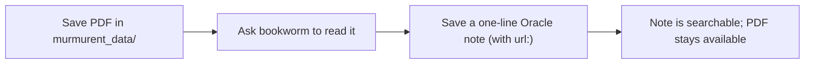

# Vignette 4: add a reference document (`murmurent_data/`)

## The situation

Sam finds a paper about ESR1 in breast cancer and wants Claude to be able
to read it later, and to keep the key point somewhere searchable, without
losing the paper itself. A spreadsheet of sample metadata would work the
same way.

## What you type

Sam saves the PDF into `murmurent_data/` in the vault, then asks Claude,
in plain English:

> "Read the ESR1 paper in my data folder and give me a one-line takeaway."

## What Murmurent does

1. `murmurent_data/` is a recognized vault folder for arbitrary reference
   files (PDFs, spreadsheets, protocols, images). The **bookworm** agent
   lists it, finds the PDF, and reads it, either through the
   `murmurent-data` MCP server (`data_list` then `data_read`) or by reading
   the file directly.
2. Bookworm summarises the paper.
3. Sam saves the one-line takeaway as a normal Oracle note (as in vignette
   1), adding the paper's DOI in the `url:` field. The note is the short,
   searchable fact; the PDF in `murmurent_data/` is the full source it
   points to.



## What you get

The durable, searchable memory is the short note:

```markdown
---
title: ESR1 expression predicts endocrine therapy response
date: 2026-07-23
project: brca_er
sensitivity: standard
tags: [esr1, breast-cancer, literature]
sources: ['@sam']
url: https://doi.org/10.1000/example-esr1-paper
---

# ESR1 expression predicts endocrine therapy response

Higher ESR1 expression was associated with better response to endocrine
therapy in ER-positive breast cancer.
```

The PDF stays in `murmurent_data/`, available to any agent on demand. A
spreadsheet of sample metadata, a protocol PDF, or a figure works the same
way: drop it in `murmurent_data/`, and reference it from a note when it
supports a finding.

??? note "Under the hood"
    `murmurent_data/` is a git-tracked vault folder, pinned per machine and
    resolvable with `murmurent vault paths`. Agents reach it directly and
    through the `murmurent-data` MCP server (`data_list`, `data_read`). Keep
    reference-sized files here; bulk data belongs in
    [Tier 3](../memory.md). Clinical data files should not go here, because
    the vault is pushed to GitHub; use Tier 3 storage on the lab VM
    instead. See [what Murmurent touches in your vault](../obsidian-usage.md)
    for the full folder list.
