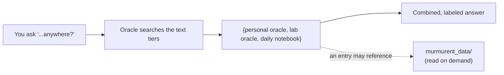

# Vignette 7: recall across all your notes

## The situation

Back on 2026-07-12, before Sam had written the polished ESR1 note from
vignette 1, Sam was mid-analysis and wrote a quick line in the
**daily lab notebook** (an informal journal, one file per day,
that Sam types directly into the dashboard): "ESR1 numbers look off in
s3, check the panel." It was never turned into a proper note. Now Sam
wants to know everything that has been recorded about ESR1, scratch
notes included.

## What you type

Sam asks the **oracle** agent in Claude Code, in plain English:

> "What have I said about ESR1 anywhere, including my daily notes?"

## What Murmurent does

1. A normal recall (vignette 2) only searches Sam's saved oracle
   notes. Asking for "anywhere, including daily notes" tells the
   oracle to widen the search to **all three text tiers at once**: Sam's
   personal oracle notes, the lab's shared oracle, and Sam's daily
   lab-notebook entries.
2. It finds two matches: the oracle note from vignette 1 and the
   daily-notebook line from days earlier.
3. It reads both back to Sam, labeled by where each came from, so
   Sam can distinguish the curated note from the informal one.

These three are the *text-searched* tiers. Reference documents in
`murmurent_data/` (vignette 4) are not part of this text sweep: their
contents are not indexed. They are reached when a matched entry references
one, or when Sam asks an agent to read a specific document. So if the ESR1
oracle note had cited a PDF in `murmurent_data/`, the recall would surface
the note, and Sam could then have the agent open that PDF for detail.

## What you get

Sam asks:

> "What have I said about ESR1 anywhere, including my daily notes?"

The oracle answers, in plain English:

> Two mentions of ESR1:
>
> - **Oracle note** (2026-07-16): ESR1 looks high in several tumour
>   samples, check against ER status.
> - **Daily notebook** (2026-07-12): "ESR1 numbers look off in s3,
>   check the panel."

Sam now sees the early scratch note that flagged the problem days
before it became a proper observation, something a normal recall
alone would have missed.

??? note "Under the hood"
    See [the daily lab notebook guide](../lab_notebook_guide.md) for
    what it is and where it lives, [the oracle workflow](../oracle-workflow.md)
    for how a normal recall covers only your saved notes while asking
    for "everything" also sweeps the daily notebook,
    [the memory tiers](../memory.md) for how personal, lab, and
    notebook memory fit together, and
    [reference files](../murmurent_data.md) for how documents in
    `murmurent_data/` are reached (read on demand, not text-searched).
