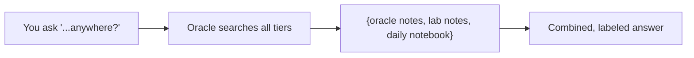

# Vignette 7: recall across all your notes

## The situation

Back on 2026-07-12, before Sam had written the polished ESR1 note from
vignette 1, Sam was mid-analysis and dashed off a quick line in the
**daily lab notebook** (a rough scratch journal, one file per day,
that Sam types straight into the dashboard): "ESR1 numbers look off in
s3, check the panel." It was never turned into a proper note. Now Sam
wants to know everything that's ever been said about ESR1, scratch
notes included, not just the tidy ones.

## What you type

Sam asks the **oracle** agent in Claude Code, in plain English:

> "What have I said about ESR1 anywhere, including my daily notes?"

## What Murmurent does

1. A normal recall (vignette 2) only searches Sam's saved oracle
   notes. Asking for "anywhere, including daily notes" tells the
   oracle to widen the search to **all three tiers at once**: Sam's
   personal oracle notes, the lab's shared oracle, and Sam's daily
   lab-notebook entries.
2. It finds two hits: the polished oracle note from vignette 1, and
   the rough daily-notebook line from days earlier.
3. It reads both back to Sam, **labeled by where each came from**, so
   Sam can tell the careful note from the quick jotting.

## What you get

Sam asks:

> "What have I said about ESR1 anywhere, including my daily notes?"

The oracle answers, in plain English:

> Two mentions of ESR1:
>
> - **Oracle note** (2026-07-16): ESR1 looks high in several tumour
>   samples, check against ER status.
> - **Daily notebook** (2026-07-12): "ESR1 numbers look off in s3,
>   check the panel."

Sam now sees the early scratch note that flagged the problem days
before it became a proper observation, something a normal recall
alone would have missed.

??? note "Under the hood"
    See [the daily lab notebook guide](../lab_notebook_guide.md) for
    what it is and where it lives, [the oracle workflow](../oracle-workflow.md)
    for how a normal recall covers only your saved notes while asking
    for "everything" also sweeps the daily notebook, and
    [the memory tiers](../memory.md) for how personal, lab, and
    notebook memory fit together.
